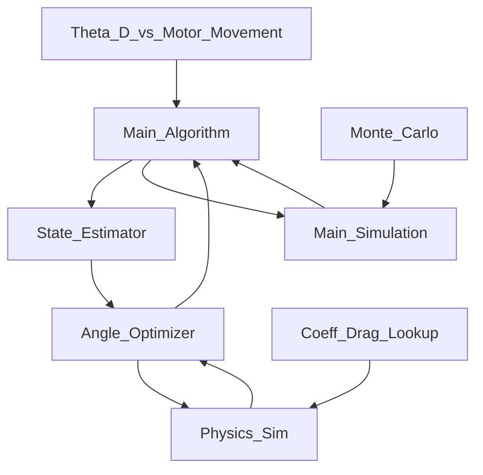

# Airbrakes

This contains code to drive the Airbreaks project for Case Rocket Team.

Using the HiLetgo BTS7960 for now...

Progress on Arduino:
1. Figured out how to control the motor. Clockwise and CounterClockwise. 
