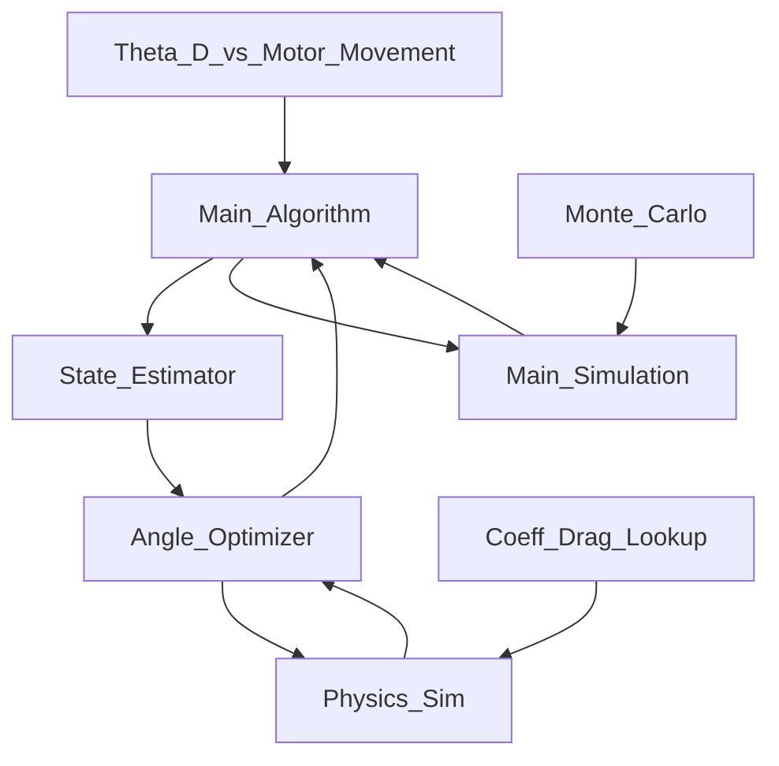

# Airbrakes

This contains code to drive the Airbreaks project for Case Rocket Team.




Using the HiLetgo BTS7960 for now... Here is a description of the current wires and what they mean(kyler here you go sir). M -> Motor. MD -> Motor Driver. T -> teensy. 
```mermaid
Red_MD -- PositiveCharge--> Red_M
Black_MD -- Connects to other motor terminal --> Black_M
Gray_T_LeftGND -- encoder GND --> Green_M
Blue_T_5V -- encoder Vcc --> Blue_M
Yellow_T_9 -- encoder A output --> Yellow_M
White_T_10 -- encoder B output --> White_M
```
Useful links:
<ol>
<li>[Documentation from Polulu](https://www.pololu.com/product/4847)</li>
   </ol>
Progress on Arduino:
1. Figured out how to control the motor. Clockwise and CounterClockwise. 
