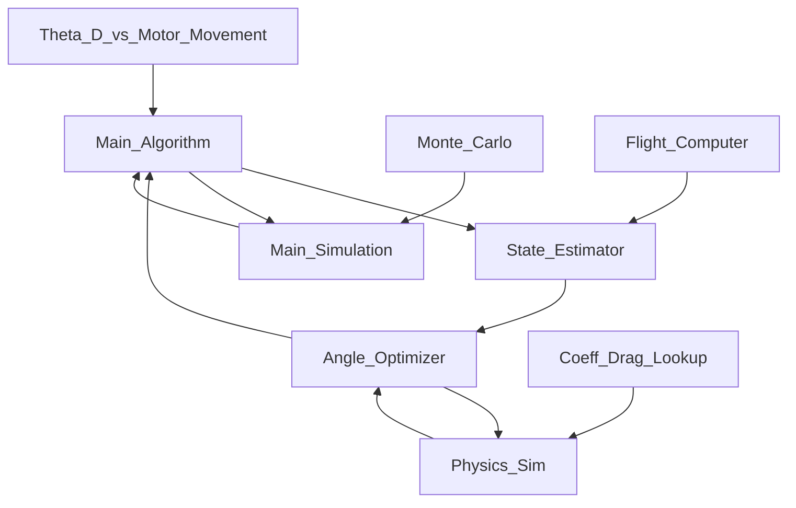

# Airbrakes

This contains code to drive the Airbreaks project for Case Rocket Team.

```mermaid
graph TD;
    Main_Algorithm-->State_Estimator;
    Theta_D_vs_Motor_Movement-->Main_Algorithm;
    Main_Simulation-->Main_Algorithm;
    Main_Algorithm-->Main_Simulation;
    Monte_Carlo-->Main_Simulation;
    State_Estimator-->Angle_Optimizer;
    Angle_Optimizer-->Physics_Sim;
    Coeff_Drag_Lookup-->Physics_Sim;
    Physics_Sim-->Angle_Optimizer;
    Angle_Optimizer-->Main_Algorithm;
    Flight_Computer-->State_Estimator;
```
